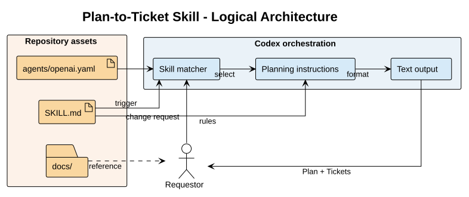

# Architecture Overview

## Scope

This repository packages one declarative Codex skill: `plan-to-ticket`. Its job is to convert a change request into a compact plan and small engineering tickets. There is no runtime service, persistent data store, external API, or deployment process in this repository.

## Logical architecture

The source for this diagram is [plan-to-ticket-architecture.puml](../diagrams/plan-to-ticket-architecture.puml). It describes the behavior exposed by the skill package rather than an application infrastructure topology.

## Responsibilities

| Asset | Responsibility | Boundary |
| --- | --- | --- |
| `SKILL.md` | Defines trigger metadata, planning rules, ticket structure, scope constraints, and verification expectations. | It produces planning text; it does not implement the planned change. |
| `agents/openai.yaml` | Supplies the display name and short interface description. | It describes the skill in the interface; it does not define planning behavior. |
| `docs/` | Explains the package structure, behavior, and maintenance expectations. | Documentation does not add executable behavior. |

## Request flow

1. A requestor provides a feature idea, requirement, bug-fix plan, refactor plan, or similar project change.
2. Codex uses the frontmatter description in `SKILL.md` to determine whether this skill applies.
3. The planning instructions use the available repository context and identify milestones, dependencies, scope boundaries, and verification.
4. The output follows the contract in `SKILL.md`: a `Plan` section followed by focused `Tickets` sections.
5. The requestor or another coding agent uses the tickets as implementation input.

## Design boundaries

- The skill is a single cohesive module because its trigger, planning rules, and output format are tightly coupled.
- The interface metadata is kept separate from behavior so presentation changes do not alter planning semantics.
- The skill does not prescribe a project framework, dependency, command, API shape, or deployment platform unless repository context establishes it.
- Ticket verification describes observable checks. It does not claim that implementation has already been completed.

## Change guidance

When changing planning behavior:

1. Update the relevant rule or output-contract section in `SKILL.md`.
2. Check that the architecture boundaries and request flow in this document remain accurate.
3. Update the README index or repository layout if files or responsibilities change.
4. Verify the Markdown structure, frontmatter, and any rendered diagram before committing.
